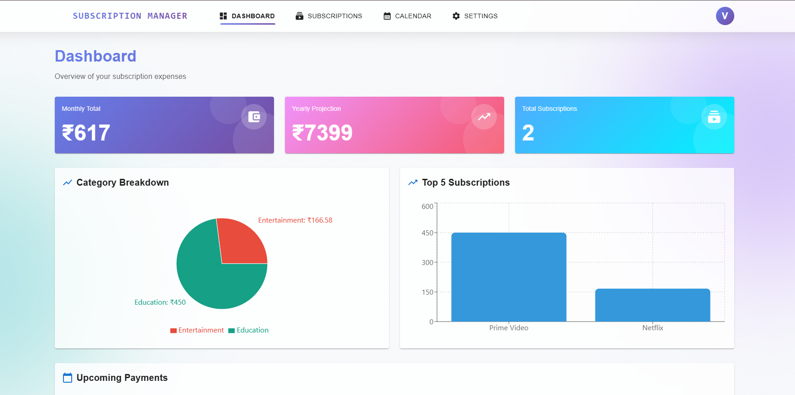

# Screenshots

Visual guide to the Subscription Manager application.

## 🏠 Landing Page / Login


Clean and modern login interface with dark mode support.

---

## 📝 Signup Page


User-friendly registration form with real-time validation.

---

## 📊 Dashboard



Comprehensive dashboard showing:
- Total subscriptions count
- Monthly and yearly spending
- Active subscriptions
- Spending by category (pie chart)
- Recent subscriptions list

---

## 💳 Subscriptions List


All subscriptions displayed with:
- Subscription name and logo
- Price and billing cycle
- Next payment date
- Category badge
- Status indicator
- Quick actions (edit, delete, mark as paid)

---

## ➕ Add Subscription


Easy-to-use form for adding new subscriptions:
- Name and description
- Price and currency
- Billing cycle (monthly, yearly, etc.)
- Category selection
- Next billing date picker
- Status selection

---

## ✏️ Edit Subscription


Update subscription details with pre-filled data.

---

## 📅 Payment Calendar


Visual calendar showing:
- All upcoming payments
- Color-coded by subscription
- Monthly view with date highlights
- Payment details on hover

---

## 🌙 Dark Mode


Beautiful dark theme with:
- Easy toggle switch in navbar
- Persistent theme selection
- Smooth transitions
- Eye-friendly colors

---

## 📱 Mobile Responsive

<div align="center">
  
  
  
</div>

Fully responsive design that works seamlessly on all devices.

---

## 🎨 Color Palette

### Light Mode
- Primary: `#1976d2` (Blue)
- Secondary: `#dc004e` (Pink)
- Background: `#f5f5f5` (Light Gray)
- Surface: `#ffffff` (White)
- Text: `#000000` (Black)

### Dark Mode
- Primary: `#90caf9` (Light Blue)
- Secondary: `#f48fb1` (Light Pink)
- Background: `#121212` (Dark Gray)
- Surface: `#1e1e1e` (Dark Surface)
- Text: `#ffffff` (White)

---

## 📐 Layout Components

### Navbar
- Logo and app name
- Navigation links (Dashboard, Subscriptions, Calendar)
- Dark mode toggle
- User menu with logout

### Cards
- Glassmorphism effect
- Shadow and hover states
- Rounded corners
- Responsive padding

### Forms
- Material-UI components
- Real-time validation
- Error messages
- Submit buttons with loading states

### Charts
- Recharts library
- Pie chart for spending by category
- Bar chart for monthly spending
- Responsive and interactive

---

## 🎯 UI/UX Features

✅ **Smooth Animations**: All interactions have smooth transitions
✅ **Loading States**: Skeleton screens and spinners
✅ **Toast Notifications**: Success and error messages
✅ **Confirmation Dialogs**: For destructive actions
✅ **Tooltips**: Helpful hints on hover
✅ **Breadcrumbs**: Easy navigation
✅ **Search & Filter**: Quick access to data
✅ **Pagination**: For large datasets
✅ **Empty States**: Friendly messages when no data

---

## 📷 How to Add Your Screenshots

To add your own screenshots to this guide:

1. Take screenshots of your deployed app
2. Create a `screenshots` folder in the project root
3. Save screenshots with descriptive names:
   - `login.png`
   - `dashboard.png`
   - `subscriptions-list.png`
   - etc.
4. Update this file with the correct image paths
5. Commit and push to GitHub

```bash
mkdir screenshots
# Add your screenshots to this folder
git add screenshots/
git commit -m "docs: Add application screenshots"
git push
```

---

**Note**: Screenshots will be displayed properly once you add them to the `screenshots` folder and push to GitHub.
